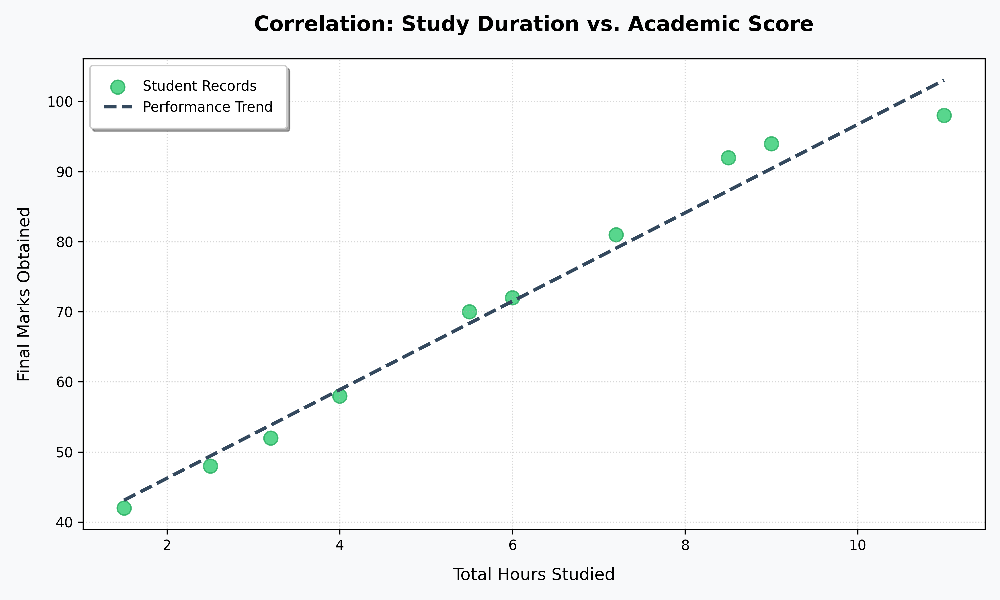

# Student Score Forecaster (Linear Regression)

This repository contains a **Supervised Machine Learning model** built using **Scikit-Learn** to predict academic scores based on the number of hours studied.  
The project focuses on understanding performance trends through **Linear Regression** and clear data visualization.

## 📊 Results
- **Model:** Linear Regression  
- **MSE:** 0.125  
- **Prediction Formula:**  
  Marks = 6.21 × (Hours Studied) + 36.33

## 🛠️ Tech Stack
- Python (Pandas, Matplotlib)  
- Scikit-Learn (Linear Regression)

